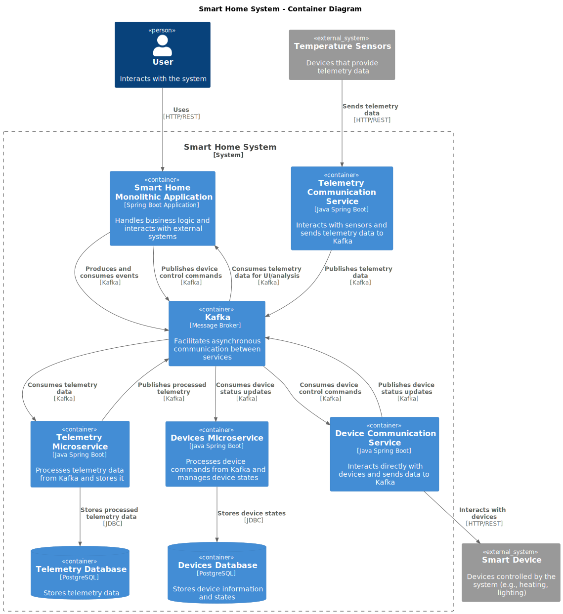

# Задание 1-1 Анализ и планирование

Анализ текущго состояния проекта

Язык программирования

    Java: Приложение написано на Java, используя версию 17.

Фреймворк

    Spring Boot: Приложение использует Spring Boot (версия 3.3.2) для создания веб-приложений и работы с базами данных через Spring Data JPA.

База данных

    PostgreSQL: Приложение использует PostgreSQL в качестве базы данных, с подключением, настроенным через Spring Data JPA.

Архитектура

    Монолитная: Все компоненты системы (обработка запросов, бизнес-логика и работа с данными) реализованы в одном приложении.

Взаимодействие

    Синхронное: Запросы обрабатываются последовательно, что типично для монолитных приложений, использующих Spring Boot.

Масштабируемость

    Ограниченная: Монолитные приложения, как правило, трудно масштабировать по частям, что может затруднить горизонтальное масштабирование.

Развертывание

    Требует полной перезагрузки: Любое обновление или изменение требует остановки и перезапуска всего приложения.


# Задание 1-2 Архитектура микросервисов

Список изменений

    Добавлены два микросервиса:

        Управление устройствами (devices-service)

        Телеметрия (telemetry-service)




# Задание 1-3 Определение сущностей

Структура сущностей
1. Пользователь (User)

    id: уникальный идентификатор пользователя
    username: имя пользователя
    email: электронная почта пользователя
    password: зашифрованный пароль
    role: роль пользователя (например, администратор, пользователь)
    created_at: дата создания пользователя
    updated_at: дата последнего обновления

2. Дом (House)

    id: уникальный идентификатор дома
    name: имя или метка дома (например, "Квартира", "Загородный дом")
    address: адрес дома
    owner_id: внешний ключ на пользователя (User), владеющего домом
    created_at: дата создания
    updated_at: дата последнего обновления

3. Устройство (Device)

    id: уникальный идентификатор устройства
    name: имя устройства (например, "Датчик температуры в гостиной")
    serial_number: серийный номер устройства
    status: состояние устройства (включено/выключено)
    type_id: внешний ключ на тип устройства (DeviceType)
    house_id: внешний ключ на дом (House)
    created_at: дата создания
    updated_at: дата последнего обновления

4. Тип устройства (DeviceType)

    id: уникальный идентификатор типа устройства
    name: название типа устройства (например, "Термостат", "Датчик движения")
    module_id: внешний ключ на модуль (Module), к которому относится этот тип устройства
    description: описание типа устройства

5. Модуль (Module)

    id: уникальный идентификатор модуля
    name: имя модуля (например, "Управление отоплением", "Безопасность")
    description: описание модуля (функции и особенности)

6. Телеметрия (TelemetryData)

    id: уникальный идентификатор записи телеметрии
    device_id: внешний ключ на устройство (Device)
    timestamp: время получения данных
    data: данные телеметрии (например, температура, влажность, состояние)
    created_at: дата создания записи

Описание связей между сущностями:

    Пользователь (User) может владеть одним или несколькими домами (House).
    Дом (House) может содержать несколько устройств (Device).
    Устройство (Device) относится к определенному типу (DeviceType).
    Тип устройства (DeviceType) связан с одним модулем (Module), который определяет функциональные группы устройств.
    Устройство (Device) может отправлять несколько записей телеметрии (TelemetryData), и каждая запись телеметрии привязана к конкретному устройству.


# Базовая настройка

## Запуск сервисов

`docker-compose up --build`

## Настройка kong

зарегистрировать сервис

```
curl -i -X POST http://localhost:8001/services/ \
  --data "name=devices-service" \
  --data "url=http://devices-service:5000"
```

создать маршрут

```
curl -i -X POST http://localhost:8001/services/devices-service/routes \
  --data "paths[]=/devices" \
  --data "strip_path=false"
```

зарегистрировать сервис

```
curl -i -X POST http://localhost:8001/services/ \
  --data "name=telemetry-service" \
  --data "url=http://telemetry-service:5001"
```

создать маршрут

```
curl -i -X POST http://localhost:8001/services/telemetry-service/routes \
  --data "paths[]=/telemetry" \
  --data "strip_path=false"
```


## Проверка сервисов

Проверка devices-service

Получение информации о устройстве:

```
curl http://localhost:8000/devices/device-1
```

Отправка состояния устройству

```
curl -X PUT http://localhost:8000/devices/device-1/status \
  --data '{"status": "on"}' \
  -H "Content-Type: application/json"
```

Отправка команды устройству

```
curl -X POST http://localhost:8000/devices/device-1/commands \
  --data '{"command": "set_temperature", "value": 22}' \
  -H "Content-Type: application/json"
```

Проверка telemetry-service

Получение данных телеметрии

```
curl http://localhost:8000/telemetry/device-1/telemetry/latest
```

Получение истории

```
curl http://localhost:8000/telemetry/device-1/telemetry
```

## Доступ к swagger

Swagger-документация для каждого микросервиса доступна по следующим URL:

    http://localhost:5000/doc для devices-service.
    http://localhost:5001/doc для telemetry-service.

## Остановка всех сервисов

```
docker-compose down -v
```
